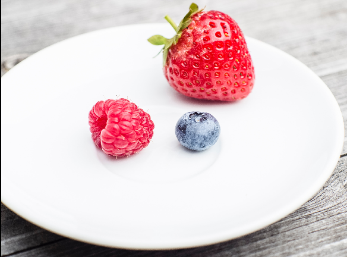

<!-- PROJECT LOGO -->
 

    
  </a>

<h3 align="center">Diet Detective</h3>

  

    Welcome to the Diet Detective, a haven for allergy-friendly dining! Users can review restaurants based on egg, peanut, or dairy allergies. Once an Admin approves these reviews, they contribute to   
the restaurant’s overall score.
 

   
  <a href="https://github.com/Nicholene/Diet_Detective" target="_blank"><strong>Explore the Repo (click here)</strong></a>
   
   
  <a href="https://medium.com/@nikkicholene2/backend-application-project-diet-detective-4557f317f72c" target="_blank"><strong>Review the In-Depth Article (click here)</strong></a>
  
  

<!-- TABLE OF CONTENTS -->

  
Table of Contents

  <ol>
    <li>
      <a href="#about-the-project">About The Project</a>
      <ul>
        <li><a href="#built-with">Built With</a></li>
      </ul>
    </li>
    <li>
      <a href="#getting-started">Getting Started</a>
      <ul>
        <li><a href="#prerequisites">Prerequisites</a></li>
        <li><a href="#installation">Installation</a></li>
      </ul>
    </li>
    <li><a href="#usage">Usage</a></li>
    <li><a href="#roadmap">Roadmap</a></li>
    <li><a href="#contributing">Contributing</a></li>
    <li><a href="#license">License</a></li>
    <li><a href="#contact">Contact</a></li>
    <li><a href="#acknowledgments">Acknowledgments</a></li>
  </ol>

<!-- ABOUT THE PROJECT -->
## About The Project

[![Product Name Screen Shot][product-screenshot]](https://example.com](https://github.com/Nicholene/Diet_Detective)

This API is designed for easy interaction and uses cURL and JSON format. The project is neatly structured with four entities, each having its own controller and service for efficient code management.
We utilize an in-memory SQL database, H2, with JPA for CRUD operations. Please note that the data resets when the application restarts. This project is not just a practical application of Java Spring API skills, but also a valuable tool for those with dietary restrictions. Looking ahead, I plan to enhance the user experience by adding a front end for a more intuitive user interface. Stay tuned for more updates!

(<a href="#readme-top">back to top</a>)

<!-- GETTING STARTED -->
## Getting Started

This is an example of how you may give instructions on setting up your project locally.
To get a local copy up and running follow these simple example steps.

### Prerequisites

Ensure you have the following installed on your local machine:
*Java JDK 20 or later
*Maven

### Installation

1. Clone the repo
  
2. Navigate to the project directory
  
3. Build the project

4. Run the application

Enjoy your coding journey! 😊

<!-- USAGE EXAMPLES -->
## Usage

Here is a simplified guide:

1. Add Users: Send a POST request to /users with the user’s details.
2. Get User Info: Send a GET request to /users/{username}.
3. Update User Info: Send a PUT request to /users/{username} with the new info.
4. Add Restaurants: Send a POST request to /api with the restaurant’s details.
5. Get Restaurant Info: Send a GET request to /api/{restaurant_id}.
6. Add Reviews: Send a POST request to /admin with the review details.
7. Approve Reviews: If you’re an Admin, send a PUT request to /admin/reviews/{review_id}.

_For specific curl commands and more examples , please refer to the [Article Here]("https://medium.com/@nikkicholene2/backend-application-project-diet-detective-4557f317f72c")_

Remember, the data resets when the app restarts as it uses an in-memory H2 database. Code away! 😊

(<a href="#readme-top">back to top</a>)

<!-- CONTRIBUTING -->
## Contributing

Contributions are what make the open-source community such an amazing place to learn, inspire, and create. Any contributions you make are **greatly appreciated**.

If you have a suggestion that would make this better, please fork the repo and create a pull request. You can also simply open an issue with the tag "enhancement".
Don't forget to give the project a star! Thanks again!

1. Fork the Project
2. Create your Feature Branch (`git checkout -b feature/AmazingFeature`)
3. Commit your Changes (`git commit -m 'Add some AmazingFeature'`)
4. Push to the Branch (`git push origin feature/AmazingFeature`)
5. Open a Pull Request

(<a href="#readme-top">back to top</a>)

<!-- LICENSE -->
## License

Distributed under the MIT License. See `LICENSE.txt` for more information.

(<a href="#readme-top">back to top</a>)

<!-- CONTACT -->
## Contact

Nicholene Davison - [Linkedin](https://www.linkedin.com/in/nicholenedavison) - nikkicholene2@gmail.com

Project Link: [https://github.com/Nicholene/Diet_Detective](https://github.com/Nicholene/Diet_Detective)

(<a href="#readme-top">back to top</a>)

<!-- ACKNOWLEDGMENTS -->
## Acknowledgments

This project was made possible thanks to:
* Online Courses: Codecademy, Coding with Mosh, and Study.com.
* Java Spring Boot: The main framework used.
* Maven: The project management tool used.
* H2 Database: The in-memory database used.
* cURL and JSON: Used for API communication.
* GitHub: Used for version control and collaboration.

(<a href="#readme-top">back to top</a>)

<!-- MARKDOWN LINKS & IMAGES -->
<!-- https://www.markdownguide.org/basic-syntax/#reference-style-links -->
[contributors-shield]: https://img.shields.io/github/contributors/github_username/repo_name.svg?style=for-the-badge

[license-url]: https://github.com/github_username/repo_name/blob/master/LICENSE.txt
[linkedin-shield]: https://img.shields.io/badge/-LinkedIn-black.svg?style=for-the-badge&logo=linkedin&colorB=555
[linkedin-url]: https://linkedin.com/in/linkedin_username
[product-screenshot]: images/screenshot.png
[Next.js]: https://img.shields.io/badge/next.js-000000?style=for-the-badge&logo=nextdotjs&logoColor=white
[Next-url]: https://nextjs.org/

